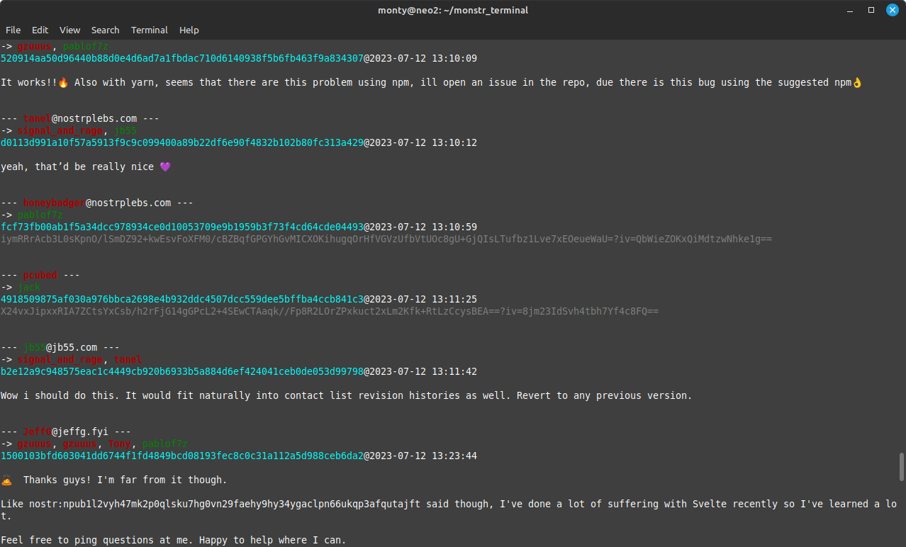
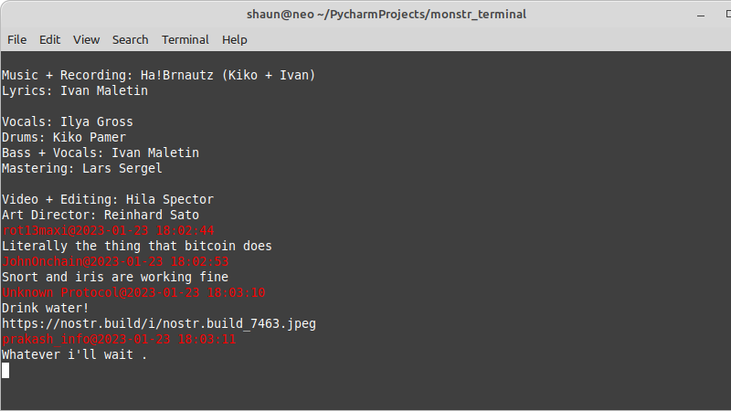

# install

```sh
git clone https://github.com/monty888/monstr_terminal.git  
cd monstr_terminal  
python3 -m venv venv   
source venv/bin/activate   
pip install .   
```

to use postgres as store psycopg2 must be installed
```sh
# install wheel helper, if needed.
pip pip install wheel
# maybe required on linux
# sudo apt install postgresql automake pkg-config libtool
# maybe required on mac
# brew install postgresql automake pkg-config libtool libffi
# now actually install psycopg2
pip install psycopg2
```

# event view
nostr event viewer for the command line. 

 


```commandline
python event_view.py --help
usage: event_view.py [-h] [-r RELAY] [-a AS_USER] [--view_profiles VIEW_PROFILES] [-v VIA] [-i EID] [-k KINDS] [-s SINCE] [-u UNTIL] [--pubkey]
                     [-t TAGS] [-p {8,12,16,20,24,28,32}] [-e] [--nip5check] [-n] [-o {formatted,json,content}] [--ssl_disable_verify] [-d]

view nostr events from the command line

options:
  -h, --help            show this help message and exit
  -c CONF, --conf CONF  name com TOML file to use for configuration,
                        default[view.toml]
  --work-dir WORK_DIR   base dir for files used if full path isn't given,
                        default[/home/monty/.nostrpy/]
  -r RELAY, --relay RELAY
                        comma separated nostr relays to connect to,
                        default[None]
  -a AS_USER, --as-user AS_USER
                        alias, priv_k or pub_k of user to view as. If only
                        created from pub_k then kind 4 encrypted events will
                        be left encrypted, default[None]
  --contacts            if --as-user lookup contacts and add to view
  --no-contacts         if --as-user DO NOT add contacts to view
  --view-extra VIEW_EXTRA
                        additional comma separated alias, priv_k or pub_k of
                        user to view, default[None]
  -v VIA, --via VIA     additional comma separated alias(with priv_k) or
                        priv_k that will be used as public inbox with wrapped
                        events, default[None]
  --direction {to,from,both}
                        if query with author keys if we are looking for events
                        sent from, sent to or both with those keys
                        default[both]
  -i EID, --id EID      comma separated event ids will be added as e tag
                        filter e.g with kind=42 can be used to view a chat
                        channel, default[None]
  -k KINDS, --kinds KINDS
                        comma separated event kinds to output, default[1,4]
  --encrypt-kinds ENCRYPT_KINDS
                        comma separated event kinds to be decrypted,
                        default[4]
  --inbox-kinds INBOX_KINDS
                        kind to use for inbox events, applied to all inboxes
                        default[4]
  -l LIMIT, --limit LIMIT
                        max number of events to return, default [20]
  -s SINCE, --since SINCE
                        show events n hours previous to running, default
                        [None]
  -u UNTIL, --until UNTIL
                        show events n hours after since, default [None]
  --hashtag HASHTAG     only events with t tag value will be matched,
                        default[None]
  --pubkey              output event author pubkey default[False]
  -t TAGS, --tags TAGS  comma separated tag types to output, =* for all
                        default[None]
  -p {8,12,16,20,24,28,32}, --pow {8,12,16,20,24,28,32}
                        minimum amount required for events excluding contacts
                        of as_user default[None]
  -e, --entities        output event_id and pubkeys as nostr entities
  --no-entities         do not output event_id and pubkeys as nostr entities
  --nip5check           nip5 checked and displayed green if valid
  -n, --nip5            valid nip5 required for events excluding contacts of
                        as_user
  --start-mode {all,first}
                        at start wait for ALL relays to return events before
                        starting to print or just FIRST default[all]
  --inbox-only          only show events that are contained in inboxes
  --no-inbox-only       events in and outside of inboxes will be shown
  -o {formatted,json,content}, --output {formatted,json,content}
                        how to display events default[formatted]
  --ssl-disable-verify  disables checks of ssl certificates
  -x {never,store}, --exit {never,store}
                        never - run indefinitely. store - exit after receiving
                        stored events. default[never]
  -d, --debug           enable debug output


```


view all event as they come in:
```shell
python event_view.py 
```
view events for a given user, also an extra user that's not in thier follows and check in additional inbox:
```shell
python event_view.py --as=<key or alias> --view=<key or alias> --via=<key or alias>
````
note that the view will be made by looking up the contacts event for the given key so that needs to be available 
on the used relays. When a user is given encrypted text will automatically be decrypted. 

If you want to simply hack on the incoming events you can use the `-o json` output option to get the raw json
for each event. See `event_view_consumer.py` for an example. 
```shell
python event_view.py --as=<key or alias> --view=<key or alias> --via=<key or alias> -o json | python event_view_consumer.py
```

# poster
post nostr events from the command line, the events can optionally be sent via an inbox (another nostr account) so that
only users with keys to that account we'll be able to decrypt the events.

```commandline
python poster.py --help
usage: poster.py [-h] [-r RELAY] [-a AS_USER] [-t TO_USERS] [-v VIA] [-s SUBJECT] [--tags TAGS]
                 [-k KIND] [-f {plaintext,encrypt,default}] [-i] [-l] [-d]
                 [message ...]

post nostr events from the command line

positional arguments:
  message               message to post

options:
  -h, --help            show this help message and exit
  -r RELAY, --relay RELAY
                        comma separated nostr relays to connect to, default
                        [wss://nostr-pub.wellorder.net,wss://nos.lol,wss://rel
                        ay.nostr.band]
  -a AS_USER, --as_user AS_USER
                        alias, priv_k of user to post as, default [monty]
  -t TO_USERS, --to_users TO_USERS
                        comma seperated alias, priv_k, or pub_k of user to
                        post to, default [None]
  -v VIA, --via VIA     alias(with priv_k) or nsec that will be used as public
                        inbox with wrapped events, default [None]
  -s SUBJECT, --subject SUBJECT
                        add subject tag to post,, default[None]
  --tags TAGS           tags to add post in format tagname:v1,v2#tagname:v1...
                        default [None]
  -k KIND, --kind KIND  kind of event to post, if not given used kind depends
                        on format - if default or plaintext then [1] if
                        encrypt then [4]
  --inbox-kind INBOX_KIND
                        if using an inbox, what kind is used for the wrapping
                        event default [4]
  -f {default,encrypt,plaintext}, --format {default,encrypt,plaintext}
                        format of the event content if default is selected
                        then events of kind 4 will be encrypted and all other
                        kinds will be plaintext
  -i, --ignore_missing  don't fail on missing to_users
  -l, --loop            stay open to enter and receive messages
  -d, --debug           enable debug output

```



### examples
send a plain text post:
```shell
python poster.py -p --as=<key or alias> hello there
```
send encrypted post to another user:
```shell
python poster.py --as=<key or alias> --to=<key or alias> hello there
```
plain post in loop mode using a mailbox - only other users with key to the mailbox will be able to view messages: 
```shell
python poster.py -pl --as=<key or alias> --via=<key or alias>
```
# alias
creates named aliases to keys so they can be referenced by user friendly name.
```commandline
usage: alias.py [-h] [-n] [-l] [-f FILENAME] [-k KEYS] profile_name

        link nostr keypairs to profile names

        alias.py <profile_name>           view existing mapping
        alias.py -n <profile_name>        map new keys auto generated
        alias.py -n <profile_name> <key>  map new with supplied key if pub_k then view only
        alias.py -l <profile_name> <key>  map existing to key, any exsting mapping overridden


positional arguments:
  profile_name          profile_name to perform action on

options:
  -h, --help            show this help message and exit
  -n, --new             create a new profile key pair link
  -l, --link            link key pair to exiting profile file, any existing mapping will be overridden
  -f FILENAME, --filename FILENAME
                        mappings in this file, default is {home}/profiles.csv
  -k KEYS, --keys KEYS  npub/nsec for the profile
```
### examples
create a new key and alias monty:
```shell
python alias.py -n monty        
```
create a new profile and link to an existing known nsec/npub
```
python alias.py -n monty -k nsec.... 
```
# relay
basic relay implementation:

```commandline
python run_relay.py --help
usage: run_relay.py [-h] [--host HOST] [--port PORT] [--endpoint ENDPOINT] [-s {sqlite,postgres,transient,none}]
                    [--dbfile DBFILE] [--pg_database PG_DATABASE] [--pg_user PG_USER] [--pg_password PG_PASSWORD]
                    [--maxsub MAXSUB] [--maxlength MAXLENGTH] [--max-before MAX_BEFORE] [--max-after MAX_AFTER] [--nip16]
                    [--no-nip16] [--nip20] [--no-nip20] [--nip33] [--no-nip33] [--nip40] [--no-nip40] [--nip42]
                    [--no-nip42] [--ssl] [--tor] [-w] [-d]

runs a nostr relay

options:
  -h, --help            show this help message and exit
  --host HOST           ip address where relay will listen, default[localhost]
  --port PORT           port relay will listen, default[8081]
  --endpoint ENDPOINT   endpoint address for the relay websocket[/]
  -s {sqlite,postgres,transient,none}, --store {sqlite,postgres,transient,none}
                        storage type to use for received events, default[sqlite]
  --dbfile DBFILE       when store is sqlite the file location for the db, default[/home/monty/.nostrpy/nostr-relay.db]
  --pg_database PG_DATABASE
                        when store is postgres the postgres db name, default[nostr-relay]
  --pg_user PG_USER     when store is postgres the postgres username, default[postgres]
  --pg_password PG_PASSWORD
                        when store is postgres the postgres password
  --maxsub MAXSUB       maximum open subs allowed per client websocket, default[10]
  --maxlength MAXLENGTH
                        maximum length for event content if any, default[None]
  --max-before MAX_BEFORE
                        maximum time before current time to accept created_at of events if any (mins), default[None]
  --max-after MAX_AFTER
                        maximum time after current time to accept created_at of events if any (mins), default[5]
  --nip16               enable NIP16 - Event treatment, ephemeral and replaceable event ranges see
                        https://github.com/nostr-protocol/nips/blob/master/16.md, default[True]
  --no-nip16            disable NIP16, default[False]
  --nip20               enable NIP20 - OK command events see https://github.com/nostr-protocol/nips/blob/master/20.md,
                        default[True]
  --no-nip20            disable NIP20, default[False]
  --nip33               enable NIP33 - Parameterized Replaceable Events see https://github.com/nostr-
                        protocol/nips/blob/master/20.md, default[True]
  --no-nip33            disable NIP33, default[False]
  --nip40               enable NIP40 - Expiration Timestamp see https://github.com/nostr-protocol/nips/blob/master/40.md,
                        default[True]
  --no-nip40            disable NIP40, default[False]
  --nip42               enable NIP42 - Authentication of clients to relays see https://github.com/nostr-
                        protocol/nips/blob/master/42.md, default[False]
  --no-nip42            disable NIP42, default[True]
  --ssl                 run ssl ssl_key and ssl_cert will need to be defined
  --tor                 make realy accessable over tor
  -w, --wipe            wipes event store and exits
  -d, --debug           enable debug output
```
The following options can currently only be set in the TOML config file: 
 

ssl_key - key file to use when --ssl flag is set  
ssl_cert - cert file to use when --ssl flag is set  
tor_password - password to be used when connecting to the Tor controller  
tor_service_dir - directory where Tor hidden service files will be created

### examples
run relay without storing any events
```shell
python run_relay.py --store=none       
```
wipe the default (sqlite) db
```
python run_relay.py --w
```

# profile search

builds up a local list of profiles for searching from the command line

```commandline
usage: profile_search.py [-h] [-r RELAY] [-a AS_USER] [-b BOOTSTRAP] [-s SINCE] [-d]

search for nostr user profiles

options:
  -h, --help            show this help message and exit
  -r RELAY, --relay RELAY
                        comma separated urls of relays to connect to - default ws://localhost:8081
  -a AS_USER, --as_user AS_USER
                        nsec/npub/hex or alias for account viewing as - default None
  -b BOOTSTRAP, --bootstrap BOOTSTRAP
                        nsec/npub/hex or alias for accounts used for bootstrapping - default None
  -s SINCE, --since SINCE
                        n days to search back for profile events - default 5
  -d, --debug           enable debug output

```

### examples

start running with as alias monty attach to relay nos.lol
```shell
python profile_search.py --as=monty --relay=wss://nos.lol       
```

on running at the > prompt type text to preform a search of seen profiles.
  
type 'exit' to quit

also follow commands are available:
* $count - returns count of profiles in cache 
* $profile {nsec/npub} [short|long|json]- show profile meta data
* $contacts {nsec/npub} [short|long|json] - show profile meta for contacts of given key
* $posts {nsec/npup} - show last 10 post for profile